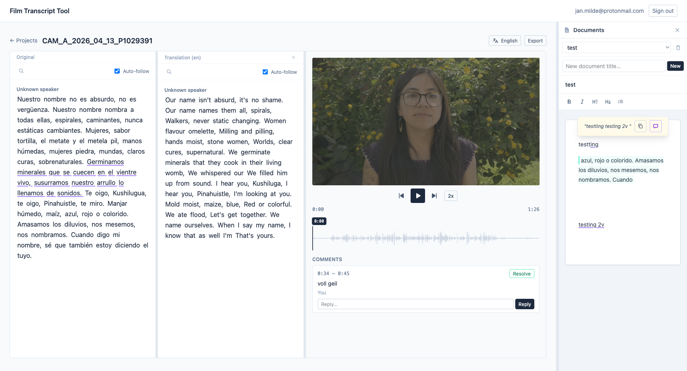
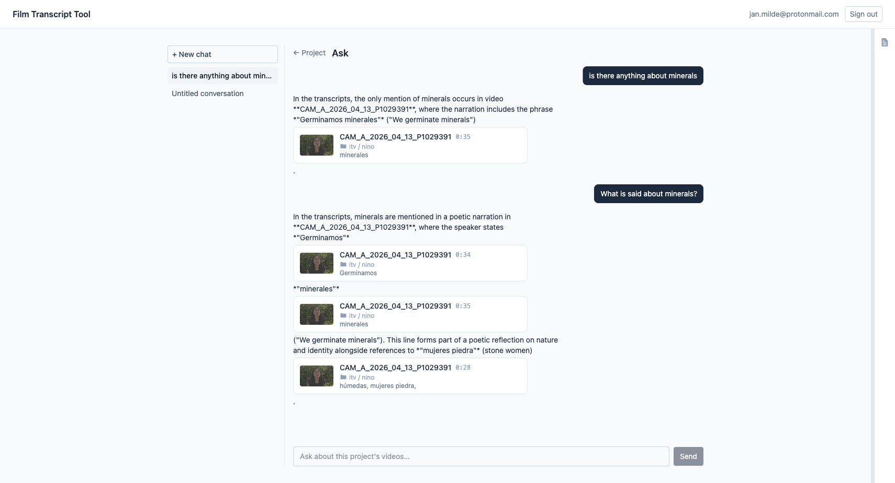
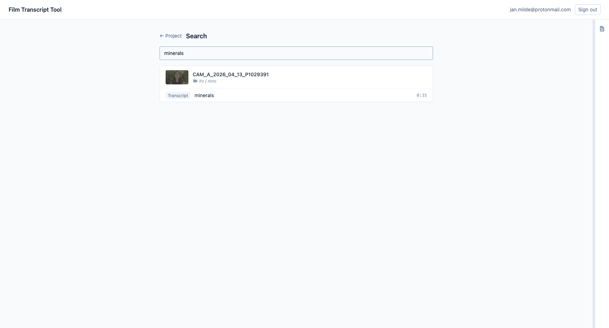
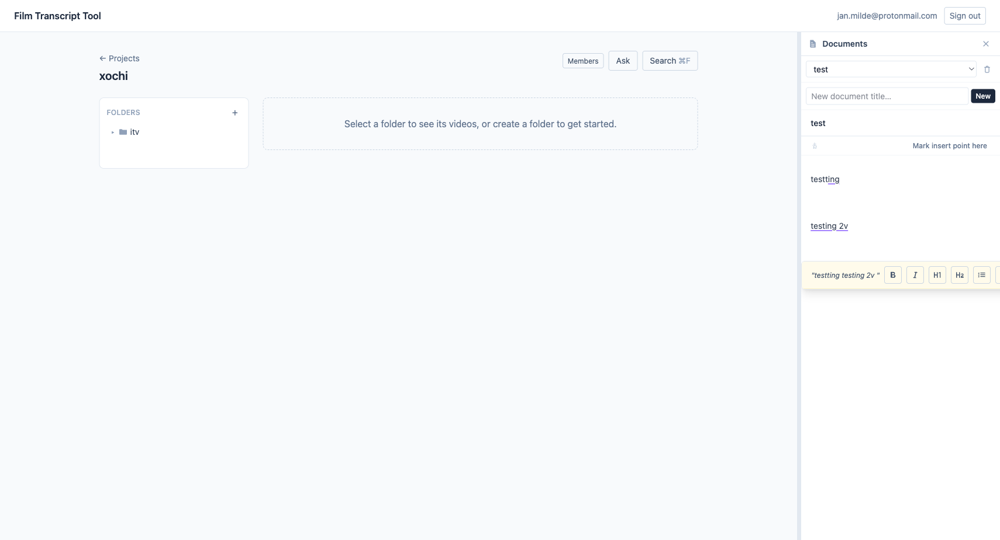
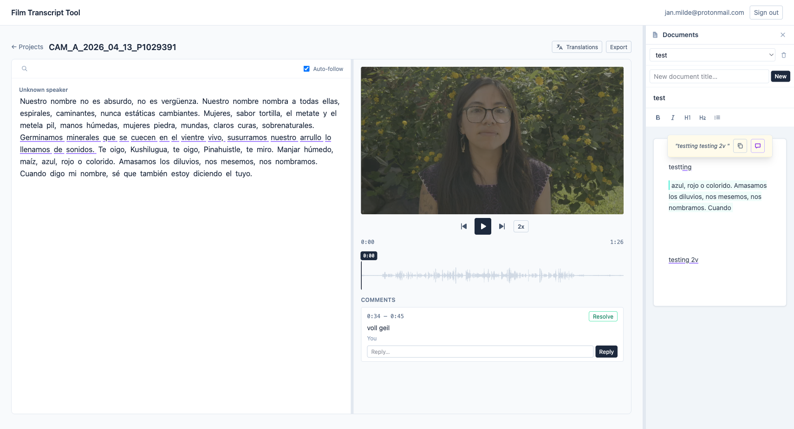
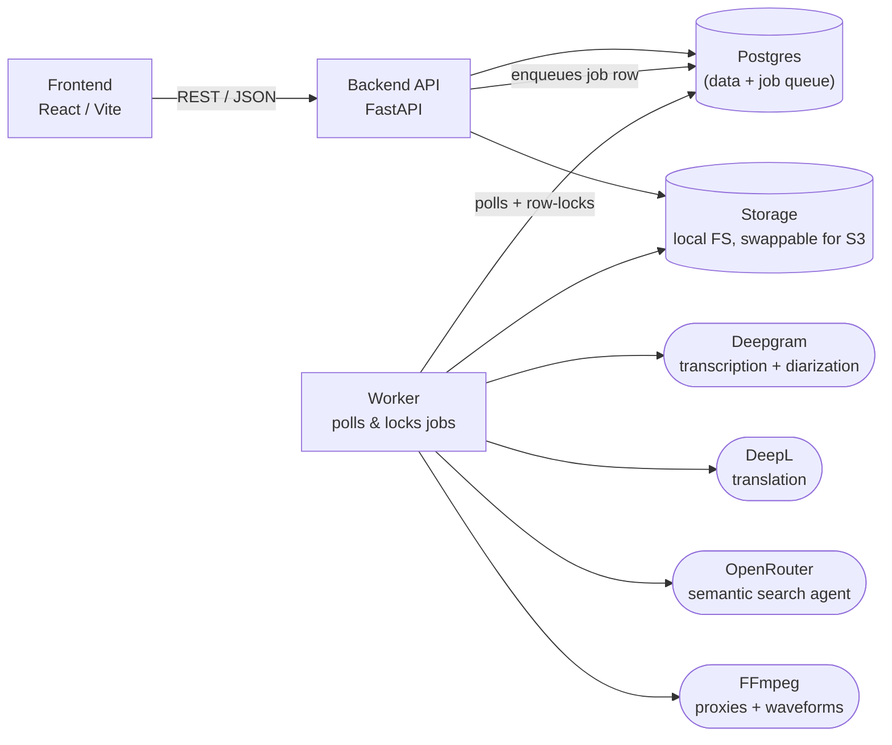

# Film Transcript Tool

A transcript-first tool for documentary filmmakers: upload footage, get automatic
speaker-diarized transcription, edit and translate the transcript, comment on
specific clips, and search across an entire project — all synced to the video
timeline. A built-in document editor lets you pull quotes straight out of any
transcript to assemble a paper edit alongside the raw footage. Built to
complement editing software like DaVinci Resolve, not replace it.



## Features

- **Automatic transcription & diarization** — Deepgram transcribes and identifies speakers, down to the word-level timestamp
- **Token-level editing** — every word is individually editable; nothing is destructively overwritten, so the original transcript is always recoverable
- **Translation** — machine-translate a transcript into another language as an independent, editable copy, side-by-side with the original
- **Timeline sync** — click any word to jump the video to that moment; playback auto-scrolls the transcript
- **Comments** — anchor threaded comments to a time range or a specific span of text
- **Full-text & semantic search** — find a phrase across every video in a project, or ask a project-scoped AI assistant a question in plain language and get answers grounded in cited transcript excerpts
- **Documents** — a rich-text editor per project for drafting, with one-click insertion of transcript quotes (linked back to their source clip)
- **Nested projects & folders**, proxy + waveform generation, Markdown/SRT export

## Screenshots

| | |
|---|---|
| <br>Ask a question, get cited transcript excerpts | <br>Full-text search across a project |
| <br>Notes panel alongside the project view | <br>Video, transcript, comments, and notes in one view |

## Tech stack

**Backend** — Python, FastAPI, SQLAlchemy 2, Pydantic v2, Alembic, Postgres-backed job queue worker, `uv`
**Frontend** — React, TypeScript, Vite, Tailwind CSS, TanStack Query, Tiptap
**Infra** — PostgreSQL, Supabase (auth), Deepgram (transcription), FFmpeg (proxies/waveforms), Docker



The frontend never touches Postgres or media files directly — it only calls
the backend API. The API handles auth, validation, and DB transactions, but
never does long-running work inline: transcription, translation, proxy/waveform
generation, and exports are all jobs the worker picks up from a Postgres-backed
queue (row-locking, no separate broker). See
[`docs/300_architecture.md`](docs/300_architecture.md) for the full design.

## Running locally

Requires Docker, Python 3.12+ with [`uv`](https://docs.astral.sh/uv/), Node 20+, and a free [Supabase](https://supabase.com) project (used only for auth), plus a [Deepgram](https://deepgram.com) API key.

```bash
# 1. Start local Postgres (Docker)
docker compose up -d --wait db-dev

# 2. Configure the backend
cp backend/.env.example backend/.env
# fill in SUPABASE_URL / SUPABASE_PUBLISHABLE_KEY / SUPABASE_JWKS_URL and DEEPGRAM_API_KEY
# DATABASE_URL already points at the local db-dev container

# 3. Migrate the database
make db-migrate

# 4. Run the app (each in its own terminal)
make run-backend   # http://localhost:8000
make run-worker
make run-frontend  # http://localhost:5173
```

Sign in through the frontend with your Supabase Auth project — the matching
`User` row is created automatically on first login, and creating a project
grants you `OWNER` membership. No seed script needed.

Run `make help` for the full list of developer commands (tests, lint, type
checks, etc.).

## Documentation

The `/docs` directory is the source-of-truth spec for the whole system —
product requirements, data model, processing pipeline, API surface, and more.

| Document | Covers |
|-----------|-------------|
| [`100_product_spec.md`](docs/100_product_spec.md) | Functional requirements |
| [`300_architecture.md`](docs/300_architecture.md) | System architecture |
| [`400_database.md`](docs/400_database.md) | Data model |
| [`600_processing_pipeline.md`](docs/600_processing_pipeline.md) | Async processing pipeline |
| [`700_backend_api.md`](docs/700_backend_api.md) | REST API |
| [`800_frontend.md`](docs/800_frontend.md) | Frontend structure |
